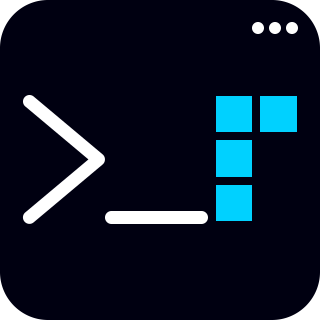

<p align="center"></p>

<p align="center">

</p>

Purely and accurately overwrites the previous output in the terminal, while maintaining the history of third-party logs.


## Install

```console
npm install stdout-update

yarn add stdout-update
```

## Usage

```javascript
const { UpdateManager } = require('../lib/update-manager');
const manager = UpdateManager.getInstance();

const frames = ['⠋', '⠙', '⠹', '⠸', '⠼', '⠴', '⠦', '⠧', '⠇', '⠏'];
const messages = ['Swapping time and space...', 'Have a good day.', "Don't panic...", 'Updating Updater...', '42'];
let i = (j = 0);
let number = 60;

manager.hook();

console.log(' - log message');
console.error(' - error message');
console.warn(' - warn message');

const id = setInterval(() => {
    if (--number < 0) {
        clearInterval(id);
        manager.update(['✔ Success']);
        manager.update(['', 'Messages:'], 1);
        manager.unhook();
    } else {
        const frame = frames[(i = ++i % frames.length)];
        const message = messages[(j = Math.round(number / 10) % messages.length)];

        manager.update([`${frame} Some process...`, message]);
    }
}, 80);
```

## API

### getInstance()

Method to get the object to control the streams (`stdout`, `stderr`) update. Returns `UpdateManager` instance.

### hook()

Hook stdout and stderr streams.

### unhook()

Unhooks both stdout and stderr streams and print their story of logs.

### update(lines, [position])

Method to get the object to control the streams (`stdout`, `stderr`) update. Returns `UpdateManager` instance.

#### lines

Type: `string[]`

Lines to write to standard output.

#### position

Type: `number`

Default: `0`

Index of the line starting from which the contents of the terminal are being overwritten.

### isHooked()

Returns the activity status of the hook.

## Examples

[tasktree-cli](https://github.com/keindev/tasktree) - Simple terminal task tree - helps you keep track of your tasks in a tree structure.

## License

[MIT](LICENSE)
